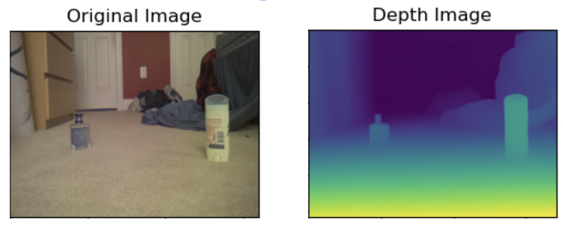
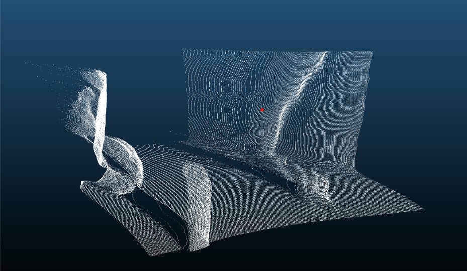
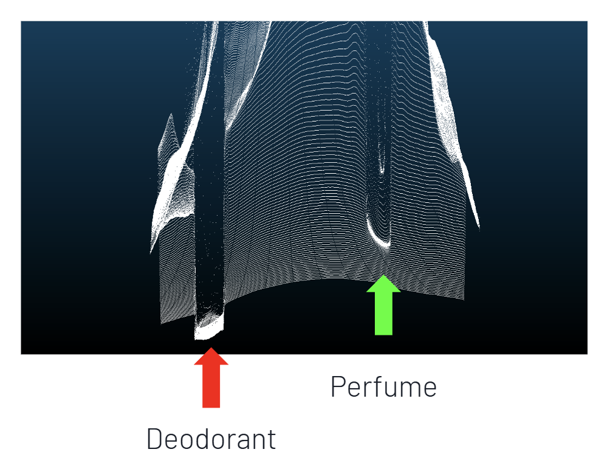
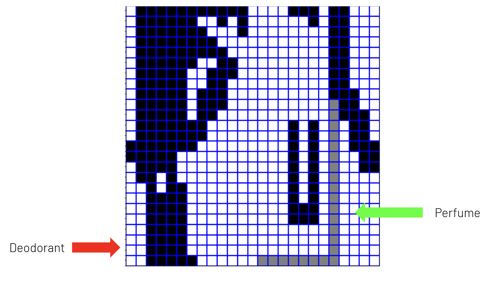

# Monocular Vision-Based Path Planning for Autonomous Navigation

A path planning system that uses monocular depth estimation to generate navigable paths for autonomous rovers, implemented on a Jetson Nano platform.

## Overview

This project implements a vision-based path planning system using a single camera input, optimized for deployment on the NVIDIA Jetson Nano. The system processes video frames to generate 3D point clouds, analyzes terrain traversability, and plans optimal navigation paths while avoiding obstacles.

### Key Features

- Real-time depth estimation from monocular camera input using Jetson Nano
- 3D point cloud generation and processing
- Cost-based terrain analysis
- A* path planning algorithm implementation
- Optimized for embedded deployment

## System Architecture

The system consists of three main components:

1. **Depth Estimation and Point Cloud Generation**
   - Uses DepthAnything's ViT-S model for depth inference
   - Converts 2D depth maps to 3D point clouds
   ```python:image_to_pointcloud.py
   startLine: 18
   endLine: 31
   ```

2. **Terrain Analysis**
   - Implements grid-based terrain segmentation
   - Calculates traversability costs
   ```python:GridBox.py
   startLine: 35
   endLine: 69
   ```

3. **Path Planning**
   - A* algorithm implementation for optimal path finding
   - Avoids obstacles while minimizing energy costs
   ```python:AStar.py
   startLine: 9
   endLine: 42
   ```

## Implementation Details

### Point Cloud Generation

The system processes video frames through these steps:

1. Depth estimation using DepthAnything model
2. Point cloud generation using camera intrinsics
3. Filtering and optimization of point cloud data


*Comparison between original camera input and generated depth map*

### Terrain Analysis

The terrain analysis module implements two key cost functions to evaluate traversability:

#### Slope Climbing Cost Function
- Fits a plane to each grid cell using least squares regression
- Calculates slope angle θ from the fitted plane
- If θ > θ<sub>max</sub> (maximum climbable angle), cost = infinity
- Otherwise, cost = M * g * L * sin(θ), where:
  - M = rover mass
  - g = gravitational acceleration
  - L = length of fitted plane

#### Obstacle Crossing Cost Function
- Calculates l<sub>obs</sub> (maximum obstacle height) in each cell
- If l<sub>obs</sub> > l<sub>max</sub> (maximum traversable height), cost = infinity
- Otherwise, cost = M * g * l<sub>obs</sub>
- Helps identify impassable obstacles while allowing traversal of minor terrain variations

The total cost for each cell is the sum of these two functions, creating a comprehensive traversability map.

### Point Cloud Visualization

The system generates detailed 3D point clouds from the depth data:


*3D point cloud visualization showing spatial mapping of the environment*


*Overhead view of the point cloud*


*Labeled point cloud visualization*

## Performance

The system was evaluated using:
- KITTI dataset for depth estimation accuracy
- Real-world testing on various terrain types
- Performance benchmarking on Jetson Nano
  - Optimized for real-time processing on embedded hardware
  - Balanced accuracy with computational efficiency

## Limitations and Future Work

- Limited by monocular depth estimation accuracy
- Processing speed constraints on Jetson Nano
- Potential for improvement in extreme lighting conditions

## Acknowledgments

- Based on research by Chen et al. (2023)
- Uses DepthAnything's ViT-S model
- Developed during a research internship at [Institution Name]